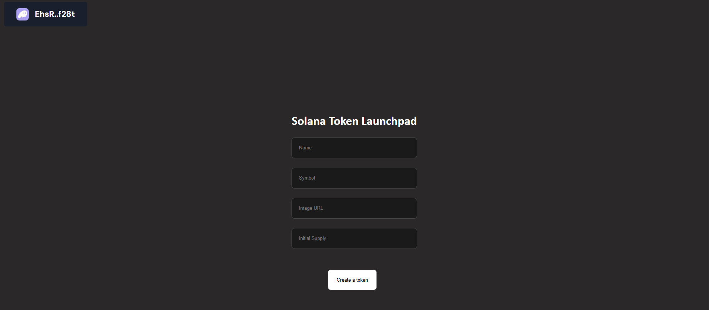

# 🚀 Solana Token Launchpad

This is a **starter project** for creating custom SPL tokens on the **Solana blockchain**. Built using React, Solana Wallet Adapter, and SPL Token SDK.
Users can connect their wallet, input token details, and mint new tokens on Devnet.

---

## 🧱 Starter Code

The code contains the basic HTML and CSS structure for a token launchpad, along with:

* Wallet integration (Phantom support)
* Minting SPL tokens on Solana Devnet
* Minimal input form for token metadata
* Styled with simple UI layout

---

## 🛠 Tech Stack

* ⚛️ React (Vite or CRA)
* 🔗 Solana Web3.js
* 🪙 @solana/spl-token
* 👛 Solana Wallet Adapter (Phantom)
* 📦 gh-pages for deployment

---

## 🧩 Features

* ✅ Connect with Phantom Wallet
* 🪙 Create a new SPL Token
* 📄 Enter token details: name, symbol, image URL, initial supply
* 🔒 Tokens minted to the connected wallet
* 🧪 Runs on Solana Devnet

---

## ⚙️ Setup Instructions

### 1. Clone the Repository

```bash
git clone https://github.com/YOUR_USERNAME/solana-token-launchpad.git
cd solana-token-launchpad
```

### 2. Install Dependencies

```bash
npm install
```

### 3. Add Solana Wallet Adapters

```bash
npm install @solana/web3.js \
  @solana/wallet-adapter-base \
  @solana/wallet-adapter-react \
  @solana/wallet-adapter-wallets \
  @solana/wallet-adapter-react-ui \
  @solana/spl-token \
  gh-pages
```

---

npm run dev    # for Vite
npm start      # for CRA
```


## 🙌 Acknowledgments


---

## 📸 Preview

*(You can add a screenshot here if you want, using markdown image syntax)*



```

---
